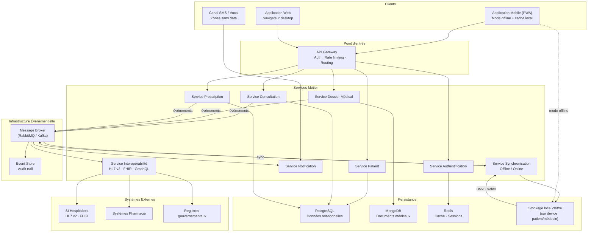
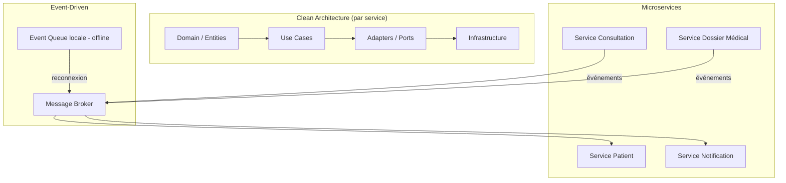
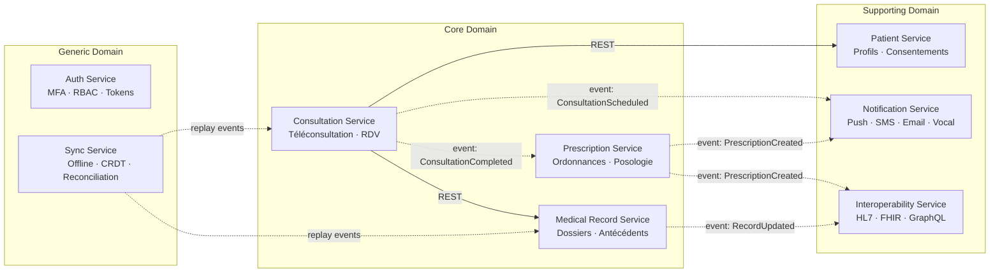
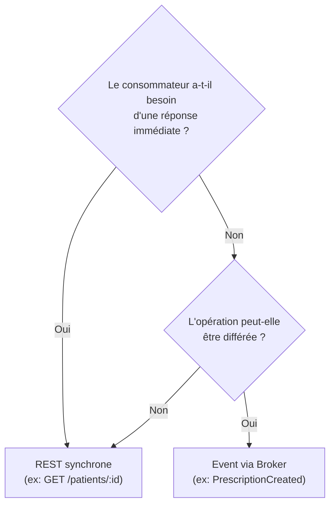
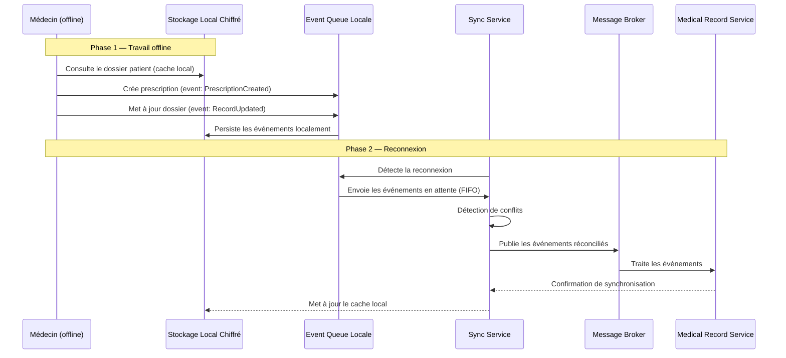

# Partie 2 — Proposition et Justification de l'Architecture

> **Responsable** : _Membre 2 — Architecte Système_
> **Points** : 4/20

---

## Table des matières

- [1. Vision architecturale globale](#1-vision-architecturale-globale)
- [2. Styles architecturaux retenus](#2-styles-architecturaux-retenus)
- [3. Analyse comparative des alternatives](#3-analyse-comparative-des-alternatives)
- [4. Architecture détaillée](#4-architecture-détaillée)
- [5. Communication inter-services](#5-communication-inter-services)
- [6. Gestion du mode offline](#6-gestion-du-mode-offline)
- [7. Sécurité et conformité](#7-sécurité-et-conformité)
- [8. Justification des choix](#8-justification-des-choix)

---

## 1. Vision architecturale globale

HealthRuralNet est structuré en une architecture distribuée orientée microservices et événements, conçue pour fonctionner en conditions de connectivité dégradée. Le schéma ci-dessous présente la vue haut niveau du système.

### 1.1 Diagramme d'architecture globale

### 1.2 Lecture du diagramme

| Couche | Rôle | Contrainte adressée |
| ------ | ---- | ------------------- |
| Clients | Applications PWA mobile-first + web + canal SMS | Accessibilité zones rurales, patients peu technophiles |
| API Gateway | Point d'entrée unique, authentification, rate limiting | Sécurité, routage, protection des services |
| Services Métier | 8 microservices à responsabilité unique | Modularité, déploiement indépendant, scalabilité ciblée |
| Message Broker | Communication asynchrone inter-services | Mode offline, découplage temporel, résilience |
| Event Store | Journal immuable de tous les événements | Traçabilité réglementaire (RGPD/HIPAA) |
| Persistance | Polyglot persistence (SQL + NoSQL + cache) | Données structurées vs documents médicaux vs performance |
| Stockage local | Cache chiffré sur device | Mode déconnecté, continuité de service |
| Systèmes externes | Adaptateurs vers SI hospitaliers | Interopérabilité formats hétérogènes |

## 2. Styles architecturaux retenus

L'architecture de HealthRuralNet repose sur la combinaison de trois styles complémentaires, chacun répondant à des contraintes spécifiques identifiées dans le contexte du projet.

### 2.1 Architecture Microservices

**Choix** : Découper le système en services métier indépendants, chacun responsable d'un domaine fonctionnel précis (consultation, dossier médical, authentification, notification, etc.).

**Justification par le contexte HealthRuralNet** :

- **Modularité** : Le sujet décrit un écosystème complexe avec des besoins hétérogènes — téléconsultation, dossier médical, prescription, interconnexion hospitalière. Chaque domaine a son propre rythme d'évolution et ses propres contraintes. Un monolithe forcerait un couplage fort entre ces domaines, rendant chaque modification risquée pour l'ensemble.
- **Scalabilité ciblée** : Le service de téléconsultation (vidéo/audio) a des besoins en bande passante et en compute radicalement différents du service de gestion des dossiers médicaux. Les microservices permettent de scaler indépendamment chaque composant selon sa charge réelle.
- **Déploiement indépendant** : HealthRuralNet opère dans plusieurs pays avec des réglementations différentes. Un microservice dédié à la conformité peut être adapté et redéployé par région sans impacter le reste du système.
- **Résilience** : En zone rurale, la tolérance aux pannes est critique. Si le service de notification tombe, les consultations en cours ne doivent pas être interrompues. L'isolation des services garantit cette résilience.

**Impact sur la maintenabilité** : Chaque service peut être développé, testé et déployé par une équipe autonome. Les contrats d'interface (API) garantissent que les changements internes n'impactent pas les autres services.

### 2.2 Architecture Événementielle (Event-Driven)

**Choix** : Superposer une couche événementielle au-dessus des microservices, basée sur un message broker, pour gérer la communication asynchrone et la synchronisation des données.

**Justification par le contexte HealthRuralNet** :

- **Mode offline critique** : Le sujet insiste sur la connectivité variable des zones rurales. Une architecture événementielle permet de stocker les événements localement (queue locale) quand la connexion est absente, puis de les rejouer à la reconnexion. C'est fondamentalement impossible avec une architecture purement synchrone (REST classique).
- **Découplage temporel** : Un médecin rédige une prescription offline. L'événement `PrescriptionCreated` est mis en file d'attente locale. Quand la connexion revient, l'événement est propagé au service Dossier Médical, au service Pharmacie et au service Notification sans que le médecin ait besoin d'être encore connecté.
- **Interopérabilité asynchrone** : Le sujet mentionne des SI hospitaliers utilisant HL7 v2, FHIR et même des fax. La synchronisation avec ces systèmes est par nature asynchrone et non temps réel. Les événements permettent une intégration progressive sans bloquer le flux principal.
- **Audit et traçabilité** : Dans le domaine médical, chaque action doit être traçable. Un event store conserve l'historique complet des événements, offrant un audit trail natif — une exigence réglementaire (RGPD, HIPAA).

**Impact sur la scalabilité** : Les événements permettent un découplage producteur/consommateur. Ajouter un nouveau consommateur (ex. : un service d'analytique épidémiologique) ne nécessite aucune modification des services existants.

### 2.3 Clean Architecture (par service)

**Choix** : Organiser l'intérieur de chaque microservice selon les principes de la Clean Architecture (Hexagonale), avec une séparation stricte entre domaine métier, cas d'usage, adaptateurs et infrastructure.

**Justification par le contexte HealthRuralNet** :

- **Indépendance technologique** : Le sujet montre un historique de changements technologiques fréquents (Skype → SaaS → solution propre). La Clean Architecture isole le domaine métier des choix d'infrastructure, permettant de changer de base de données, de framework ou de protocole de communication sans réécrire la logique métier.
- **Testabilité** : Les règles métier médicales (validation de prescription, calcul de posologie, vérification d'interactions médicamenteuses) sont critiques et doivent être testées unitairement sans dépendre d'une base de données ou d'un serveur. La séparation en couches le permet nativement.
- **Conformité réglementaire** : Les règles RGPD/HIPAA sont implémentées dans la couche domaine, pas dans l'infrastructure. Si la réglementation change, seul le domaine est modifié, pas les adaptateurs.
- **Ports & Adapters** : Le pattern Adapter (identifié en Part 3) s'intègre naturellement dans cette architecture — les adaptateurs HL7, FHIR et GraphQL implémentent des ports définis par le domaine.

**Impact sur l'évolutivité** : Ajouter un nouveau canal de communication (ex. : SMS pour zones sans data) revient à écrire un nouvel adaptateur sans toucher au domaine métier.

### 2.4 Synthèse de la combinaison

Les trois styles ne sont pas en concurrence mais en complémentarité :

- **Microservices** = organisation macro (comment découper le système)
- **Event-Driven** = communication et résilience (comment les services échangent)
- **Clean Architecture** = organisation micro (comment structurer chaque service en interne)

## 3. Analyse comparative des alternatives

Le choix architectural ne s'est pas fait par défaut. Trois architectures candidates ont été évaluées en regard des contraintes spécifiques de HealthRuralNet.

### 3.1 Tableau comparatif

| Critère | Monolithique | SOA / ESB | Microservices + Event-Driven |
| ------- | ------------ | --------- | ---------------------------- |
| **Modularité** | Faible — couplage fort entre modules, modification risquée | Moyenne — services découplés mais ESB central crée un SPOF | **Forte** — services indépendants, contrats d'interface stricts |
| **Scalabilité** | Verticale uniquement — tout le système scale ensemble | Moyenne — scale par service mais l'ESB devient goulot | **Horizontale et ciblée** — chaque service scale selon sa charge |
| **Maintenabilité** | Décroissante — dette technique s'accumule dans un seul codebase | Moyenne — dépend de la qualité de l'ESB et de la gouvernance | **Forte** — petits codebases autonomes, déploiement indépendant |
| **Complexité initiale** | **Faible** — un seul projet, déploiement simple | Moyenne — nécessite un ESB, configuration des flux | Élevée — infrastructure distribuée, monitoring, orchestration |
| **Mode offline** | Très difficile — le monolithe suppose une connexion permanente | Difficile — l'ESB est un point central qui doit être joignable | **Natif** — les événements se stockent localement et se rejouent |
| **Interopérabilité SI** | Complexe — les adaptateurs s'ajoutent dans le monolithe | **Bonne** — c'est le cas d'usage historique du SOA | **Bonne** — service dédié d'interopérabilité avec adaptateurs |
| **Résilience** | Faible — une panne impacte tout le système | Moyenne — l'ESB peut devenir SPOF | **Forte** — isolation des pannes par service |
| **Adapté au contexte rural** | Non — suppose infrastructure stable et connexion fiable | Partiellement — l'ESB centralisé pose problème en zone isolée | **Oui** — conçu pour la distribution et la résilience réseau |

### 3.2 Pourquoi le monolithique a été écarté

Le sujet décrit explicitement l'échec de l'approche initiale de HealthRuralNet : des outils monolithiques (Skype, Zoom) qui ne permettaient pas d'intégrer les dossiers médicaux, de fonctionner offline, ni de respecter les normes de sécurité. Un monolithe reproduirait ces mêmes limitations :

- Impossible de scaler la téléconsultation vidéo indépendamment de la gestion des dossiers
- Mode offline ingérable sans architecture événementielle
- Couplage fort rendant l'interopérabilité avec les SI hospitaliers coûteuse

### 3.3 Pourquoi le SOA / ESB a été écarté

Le sujet mentionne que certains acteurs internes ont proposé un ESB pour centraliser les flux. Cette approche a été écartée pour plusieurs raisons :

- **SPOF** : l'ESB centralisé est incompatible avec la connectivité intermittente des zones rurales. Si l'ESB est injoignable, tout le système est paralysé.
- **Rigidité** : le sujet décrit les difficultés d'intégration avec les plateformes SaaS qui imposaient leur propre format de données. Un ESB reproduirait cette rigidité en imposant un schéma de médiation centralisé.
- **Coût de gouvernance** : le sujet mentionne des équipes aux pratiques hétérogènes. Un ESB nécessite une gouvernance forte et centralisée, ce qui est irréaliste dans ce contexte multi-acteurs.

### 3.4 Pourquoi Microservices + Event-Driven est retenu

Cette combinaison est la seule à répondre simultanément aux trois contraintes majeures du sujet :

1. **Connectivité variable** → l'architecture événementielle permet le mode offline natif
2. **Interopérabilité hétérogène** → un service dédié avec adaptateurs (Adapter Pattern) isole la complexité
3. **Multi-pays / multi-réglementation** → le découpage en services permet d'adapter la conformité par région sans impacter le reste

Le surcoût en complexité initiale est assumé et maîtrisé par l'adoption de la Clean Architecture en interne de chaque service (cf. section 2.3).

## 4. Architecture détaillée

Le système est découpé en **8 microservices**, chacun aligné sur un domaine fonctionnel distinct. Ce découpage suit le principe du Bounded Context (DDD) pour minimiser le couplage.

### 4.1 Catalogue des microservices

| Service | Domaine | Responsabilités | Base de données |
| ------- | ------- | --------------- | --------------- |
| **Auth Service** | Identité & Accès | Authentification MFA, gestion tokens, permissions RBAC, délégation aidant | Redis (sessions) + PostgreSQL (utilisateurs) |
| **Patient Service** | Gestion patients | Profils patients, données démographiques, préférences, consentements RGPD | PostgreSQL |
| **Consultation Service** | Télémédecine | Création/gestion des téléconsultations (vidéo, audio, chat), planification RDV | PostgreSQL |
| **Medical Record Service** | Dossier médical | Dossiers médicaux électroniques, antécédents, allergies, historique complet | MongoDB (documents non structurés) |
| **Prescription Service** | Ordonnances | Création/validation de prescriptions, interactions médicamenteuses, posologie | PostgreSQL |
| **Notification Service** | Communication | Alertes médicales, rappels RDV, notifications push/SMS/email, canal vocal | Redis (queues) |
| **Interoperability Service** | Intégration SI | Adaptateurs HL7 v2, FHIR, GraphQL vers SI hospitaliers, pharmacies, registres | Cache de mapping (Redis) |
| **Sync Service** | Offline/Online | File d'événements locale, réconciliation, détection de conflits, CRDT | Stockage local (SQLite chiffré) |

### 4.2 Diagramme de découpage

### 4.3 Justification du découpage

- **Core Domain** (Consultation, Dossier Médical, Prescription) : ce sont les services à plus forte valeur métier et les plus complexes. Ils portent les règles métier critiques et doivent évoluer indépendamment.
- **Supporting Domain** (Patient, Notification, Interopérabilité) : services nécessaires mais dont la logique métier est plus simple. Le service d'interopérabilité isole toute la complexité de traduction de formats.
- **Generic Domain** (Auth, Sync) : services transversaux réutilisables. Le Sync Service est spécifique à HealthRuralNet (mode offline) mais techniquement générique.

## 5. Communication inter-services

### 5.1 Deux modes de communication

| Mode | Protocole | Cas d'usage | Justification |
| ---- | --------- | ----------- | ------------- |
| **Synchrone** | REST (JSON over HTTPS) | Queries : récupérer un profil patient, vérifier une authentification, lire un dossier | Le consommateur a besoin d'une réponse immédiate. REST est simple, standardisé et compatible avec les contraintes de faible débit (JSON léger). |
| **Asynchrone** | Message Broker (RabbitMQ) | Commands/Events : prescription créée, consultation terminée, alerte médicale | Le producteur n'attend pas de réponse. Permet le découplage temporel (mode offline) et la distribution vers plusieurs consommateurs. |

### 5.2 Règle de décision

### 5.3 Choix de RabbitMQ vs Kafka

| Critère | RabbitMQ | Kafka |
| ------- | -------- | ----- |
| Modèle | Message queue classique (push) | Log distribué (pull) |
| Complexité opérationnelle | Modérée | Élevée |
| Mode offline replay | Suffisant avec persistance | Natif mais surdimensionné |
| Volume attendu | Milliers de messages/jour | Millions de messages/jour |
| **Verdict** | **Retenu** — adapté au volume et à la complexité opérationnelle d'une plateforme rurale | Surdimensionné — pertinent si HealthRuralNet atteint une échelle nationale massive |

RabbitMQ est retenu pour sa simplicité opérationnelle. Le sujet décrit des zones avec infrastructure limitée — un cluster Kafka serait disproportionné. La migration vers Kafka reste possible grâce au découplage via le pattern Observer (cf. Part 3).

## 6. Gestion du mode offline

Le mode offline est la contrainte architecturale la plus différenciante de HealthRuralNet. En zone rurale, la connexion peut être absente pendant des heures, voire des jours. Le système doit permettre aux praticiens de continuer à consulter, prescrire et mettre à jour les dossiers médicaux sans connexion.

### 6.1 Stratégie globale : Event Sourcing local + sync différée

### 6.2 Stockage local chiffré

Les données médicales stockées sur le device du praticien sont chiffrées au repos :

- **Base locale** : SQLite chiffré (SQLCipher) pour les données structurées
- **Documents** : fichiers chiffrés AES-256 pour les pièces jointes (imagerie, comptes rendus)
- **Clé de chiffrement** : dérivée du token d'authentification du praticien (PBKDF2), jamais stockée en clair
- **TTL** : les données locales expirent après un délai configurable (ex. : 72h sans sync) pour limiter le risque en cas de perte du device

### 6.3 Gestion des conflits

Le scénario critique : deux praticiens modifient le même dossier patient en offline simultanément.

**Stratégie retenue : Last-Write-Wins (LWW) avec détection et alerte**

| Stratégie évaluée | Avantage | Inconvénient | Verdict |
| ------------------ | -------- | ------------ | ------- |
| CRDT (Conflict-free Replicated Data Type) | Résolution automatique sans conflit | Complexité très élevée pour des données médicales structurées. Le sujet lui-même mentionne que "personne ne sait comment cela se comporterait avec des prescriptions médicales". | Écarté |
| Merge automatique | Pas de perte de données | Risque de fusion incohérente (2 prescriptions contradictoires fusionnées) | Écarté — inacceptable pour des données médicales |
| **LWW + alerte humaine** | Simple, prévisible, auditable | Perte potentielle d'une modification | **Retenu** — la dernière écriture gagne, mais un conflit détecté génère une alerte au praticien pour validation manuelle |

**Fonctionnement** :

1. Chaque événement porte un **vector clock** (identifiant device + timestamp)
2. À la synchronisation, le Sync Service compare les vector clocks
3. Si conflit détecté : la version la plus récente est appliquée ET une alerte `ConflictDetected` est envoyée aux deux praticiens
4. Le praticien peut consulter les deux versions et valider ou corriger manuellement
5. L'historique complet est conservé dans l'Event Store (aucune donnée n'est perdue)

### 6.4 Scénarios concrets

**Scénario 1 — Prescription offline** :
Un médecin prescrit un médicament sans connexion. L'événement `PrescriptionCreated` est stocké localement. À la reconnexion, l'événement est publié vers le Prescription Service qui vérifie les interactions médicamenteuses, puis notifie la pharmacie via le service d'interopérabilité.

**Scénario 2 — Conflit de mise à jour** :
Un médecin de ville et un spécialiste hospitalier modifient le même dossier offline. Le médecin ajoute une allergie, le spécialiste met à jour le diagnostic. Les deux événements sont de nature différente (champs distincts) → pas de conflit, merge automatique. Si les deux modifient le même champ → LWW + alerte.

**Scénario 3 — Connexion intermittente (faible débit)** :
Le Strategy Pattern (cf. Part 3) détecte un réseau en mode dégradé. Le Sync Service passe en mode "delta sync" : seuls les événements critiques (prescriptions, alertes) sont synchronisés en priorité. Les données moins urgentes (mises à jour de profil) attendent une meilleure connexion.

## 7. Sécurité et conformité

<!-- Chiffrement, authentification, gestion des permissions (RBAC vs ABAC) -->

## 8. Justification des choix

<!-- Synthèse : pourquoi cette architecture répond aux besoins de HealthRuralNet -->

---

*HealthRuralNet — Evaluation Architecture Logicielle M1 — Mars 2026*
