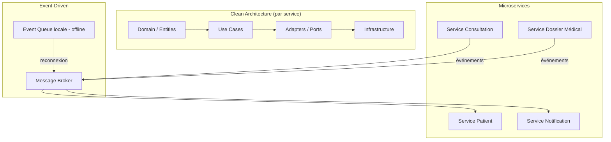
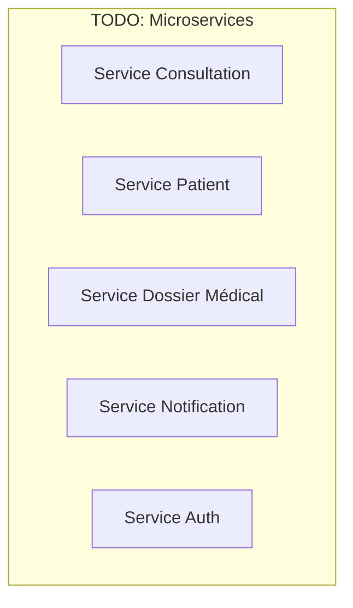

# Partie 2 — Proposition et Justification de l'Architecture

> **Responsable** : _Membre 2 — Architecte Système_
> **Points** : 4/20

---

## Table des matières

- [1. Vision architecturale globale](#1-vision-architecturale-globale)
- [2. Styles architecturaux retenus](#2-styles-architecturaux-retenus)
- [3. Analyse comparative des alternatives](#3-analyse-comparative-des-alternatives)
- [4. Architecture détaillée](#4-architecture-détaillée)
- [5. Communication inter-services](#5-communication-inter-services)
- [6. Gestion du mode offline](#6-gestion-du-mode-offline)
- [7. Sécurité et conformité](#7-sécurité-et-conformité)
- [8. Justification des choix](#8-justification-des-choix)

---

## 1. Vision architecturale globale

<!-- Schéma d'architecture haut niveau en Mermaid (diagramme de composants / C4 Context) -->

## 2. Styles architecturaux retenus

L'architecture de HealthRuralNet repose sur la combinaison de trois styles complémentaires, chacun répondant à des contraintes spécifiques identifiées dans le contexte du projet.

### 2.1 Architecture Microservices

**Choix** : Découper le système en services métier indépendants, chacun responsable d'un domaine fonctionnel précis (consultation, dossier médical, authentification, notification, etc.).

**Justification par le contexte HealthRuralNet** :

- **Modularité** : Le sujet décrit un écosystème complexe avec des besoins hétérogènes — téléconsultation, dossier médical, prescription, interconnexion hospitalière. Chaque domaine a son propre rythme d'évolution et ses propres contraintes. Un monolithe forcerait un couplage fort entre ces domaines, rendant chaque modification risquée pour l'ensemble.
- **Scalabilité ciblée** : Le service de téléconsultation (vidéo/audio) a des besoins en bande passante et en compute radicalement différents du service de gestion des dossiers médicaux. Les microservices permettent de scaler indépendamment chaque composant selon sa charge réelle.
- **Déploiement indépendant** : HealthRuralNet opère dans plusieurs pays avec des réglementations différentes. Un microservice dédié à la conformité peut être adapté et redéployé par région sans impacter le reste du système.
- **Résilience** : En zone rurale, la tolérance aux pannes est critique. Si le service de notification tombe, les consultations en cours ne doivent pas être interrompues. L'isolation des services garantit cette résilience.

**Impact sur la maintenabilité** : Chaque service peut être développé, testé et déployé par une équipe autonome. Les contrats d'interface (API) garantissent que les changements internes n'impactent pas les autres services.

### 2.2 Architecture Événementielle (Event-Driven)

**Choix** : Superposer une couche événementielle au-dessus des microservices, basée sur un message broker, pour gérer la communication asynchrone et la synchronisation des données.

**Justification par le contexte HealthRuralNet** :

- **Mode offline critique** : Le sujet insiste sur la connectivité variable des zones rurales. Une architecture événementielle permet de stocker les événements localement (queue locale) quand la connexion est absente, puis de les rejouer à la reconnexion. C'est fondamentalement impossible avec une architecture purement synchrone (REST classique).
- **Découplage temporel** : Un médecin rédige une prescription offline. L'événement `PrescriptionCreated` est mis en file d'attente locale. Quand la connexion revient, l'événement est propagé au service Dossier Médical, au service Pharmacie et au service Notification sans que le médecin ait besoin d'être encore connecté.
- **Interopérabilité asynchrone** : Le sujet mentionne des SI hospitaliers utilisant HL7 v2, FHIR et même des fax. La synchronisation avec ces systèmes est par nature asynchrone et non temps réel. Les événements permettent une intégration progressive sans bloquer le flux principal.
- **Audit et traçabilité** : Dans le domaine médical, chaque action doit être traçable. Un event store conserve l'historique complet des événements, offrant un audit trail natif — une exigence réglementaire (RGPD, HIPAA).

**Impact sur la scalabilité** : Les événements permettent un découplage producteur/consommateur. Ajouter un nouveau consommateur (ex. : un service d'analytique épidémiologique) ne nécessite aucune modification des services existants.

### 2.3 Clean Architecture (par service)

**Choix** : Organiser l'intérieur de chaque microservice selon les principes de la Clean Architecture (Hexagonale), avec une séparation stricte entre domaine métier, cas d'usage, adaptateurs et infrastructure.

**Justification par le contexte HealthRuralNet** :

- **Indépendance technologique** : Le sujet montre un historique de changements technologiques fréquents (Skype → SaaS → solution propre). La Clean Architecture isole le domaine métier des choix d'infrastructure, permettant de changer de base de données, de framework ou de protocole de communication sans réécrire la logique métier.
- **Testabilité** : Les règles métier médicales (validation de prescription, calcul de posologie, vérification d'interactions médicamenteuses) sont critiques et doivent être testées unitairement sans dépendre d'une base de données ou d'un serveur. La séparation en couches le permet nativement.
- **Conformité réglementaire** : Les règles RGPD/HIPAA sont implémentées dans la couche domaine, pas dans l'infrastructure. Si la réglementation change, seul le domaine est modifié, pas les adaptateurs.
- **Ports & Adapters** : Le pattern Adapter (identifié en Part 3) s'intègre naturellement dans cette architecture — les adaptateurs HL7, FHIR et GraphQL implémentent des ports définis par le domaine.

**Impact sur l'évolutivité** : Ajouter un nouveau canal de communication (ex. : SMS pour zones sans data) revient à écrire un nouvel adaptateur sans toucher au domaine métier.

### 2.4 Synthèse de la combinaison

Les trois styles ne sont pas en concurrence mais en complémentarité :

- **Microservices** = organisation macro (comment découper le système)
- **Event-Driven** = communication et résilience (comment les services échangent)
- **Clean Architecture** = organisation micro (comment structurer chaque service en interne)

## 3. Analyse comparative des alternatives

| Critère | Monolithique | SOA / ESB | Microservices + Event-Driven |
|---------|-------------|-----------|------------------------------|
| Modularité | | | |
| Scalabilité | | | |
| Maintenabilité | | | |
| Complexité | | | |
| Adapté au contexte rural | | | |

## 4. Architecture détaillée

<!-- Découpage en microservices : quels services, quelles responsabilités -->

## 5. Communication inter-services

<!-- Synchrone (REST/gRPC) vs Asynchrone (Message Broker), choix et justification -->

## 6. Gestion du mode offline

<!-- Stratégie de synchronisation différée, CRDT, gestion des conflits -->

## 7. Sécurité et conformité

<!-- Chiffrement, authentification, gestion des permissions (RBAC vs ABAC) -->

## 8. Justification des choix

<!-- Synthèse : pourquoi cette architecture répond aux besoins de HealthRuralNet -->

---

*HealthRuralNet — Evaluation Architecture Logicielle M1 — Mars 2026*
