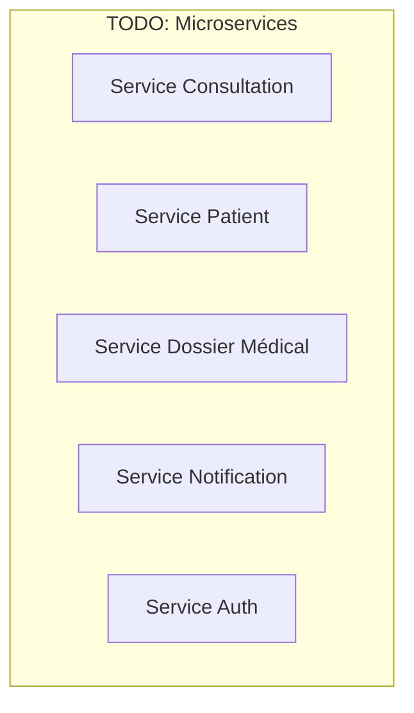

# Partie 2 — Proposition et Justification de l'Architecture

> **Responsable** : _Membre 2 — Architecte Système_
> **Points** : 4/20

---

## Table des matières

- [1. Vision architecturale globale](#1-vision-architecturale-globale)
- [2. Styles architecturaux retenus](#2-styles-architecturaux-retenus)
- [3. Analyse comparative des alternatives](#3-analyse-comparative-des-alternatives)
- [4. Architecture détaillée](#4-architecture-détaillée)
- [5. Communication inter-services](#5-communication-inter-services)
- [6. Gestion du mode offline](#6-gestion-du-mode-offline)
- [7. Sécurité et conformité](#7-sécurité-et-conformité)
- [8. Justification des choix](#8-justification-des-choix)

---

## 1. Vision architecturale globale

<!-- Schéma d'architecture haut niveau en Mermaid (diagramme de composants / C4 Context) -->

## 2. Styles architecturaux retenus

<!-- Microservices, Event-Driven, Clean Architecture — justification de chaque choix -->

### 2.1 Architecture Microservices

<!-- Pourquoi ce choix ? Impact sur modularité, scalabilité, déploiement indépendant -->

### 2.2 Architecture Événementielle (Event-Driven)

<!-- Pourquoi ce choix ? Gestion du mode offline, synchronisation asynchrone, découplage -->

### 2.3 Clean Architecture (par service)

<!-- Organisation interne de chaque microservice -->

## 3. Analyse comparative des alternatives

| Critère | Monolithique | SOA / ESB | Microservices + Event-Driven |
|---------|-------------|-----------|------------------------------|
| Modularité | | | |
| Scalabilité | | | |
| Maintenabilité | | | |
| Complexité | | | |
| Adapté au contexte rural | | | |

## 4. Architecture détaillée

<!-- Découpage en microservices : quels services, quelles responsabilités -->

## 5. Communication inter-services

<!-- Synchrone (REST/gRPC) vs Asynchrone (Message Broker), choix et justification -->

## 6. Gestion du mode offline

<!-- Stratégie de synchronisation différée, CRDT, gestion des conflits -->

## 7. Sécurité et conformité

<!-- Chiffrement, authentification, gestion des permissions (RBAC vs ABAC) -->

## 8. Justification des choix

<!-- Synthèse : pourquoi cette architecture répond aux besoins de HealthRuralNet -->

---

*HealthRuralNet — Evaluation Architecture Logicielle M1 — Mars 2026*
