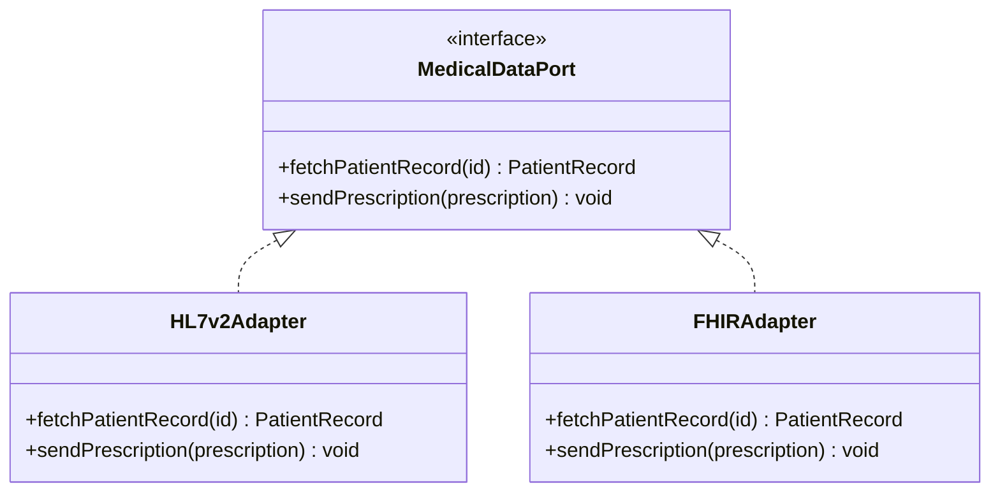
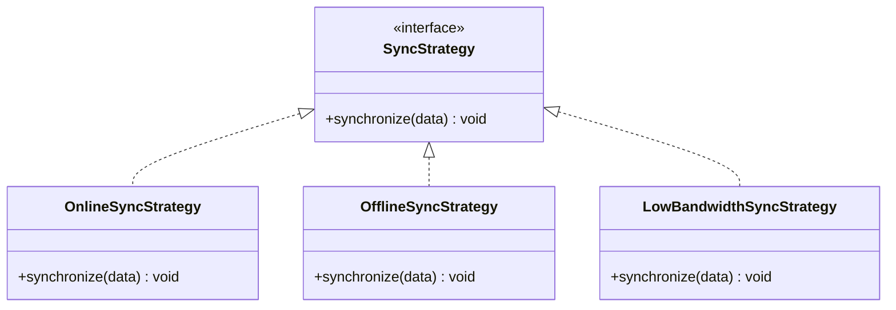

# Partie 3 — Design Patterns

> **Responsable** : _Membre 4 — Tech Lead_
> **Points** : 3/20

---

## Table des matières

- [1. Méthodologie d'identification](#1-méthodologie-didentification)
- [2. Problématiques et patterns retenus](#2-problématiques-et-patterns-retenus)
- [3. Pattern 1 — Adapter](#3-pattern-1--adapter)
- [4. Pattern 2 — Strategy](#4-pattern-2--strategy)
- [5. Pattern 3 — Circuit Breaker](#5-pattern-3--circuit-breaker)
- [6. Pattern 4 — Observer](#6-pattern-4--observer)
- [7. Synthèse](#7-synthèse)

---

## 1. Méthodologie d'identification

<!-- Comment les problématiques ont été identifiées à partir du sujet -->

## 2. Problématiques et patterns retenus

| # | Problématique concrète | Design Pattern | Catégorie |
|---|------------------------|----------------|-----------|
| 1 | Intégration avec les SI hospitaliers hétérogènes (HL7 v2, FHIR, GraphQL) | Adapter | Structural |
| 2 | Connectivité variable (4G, offline, faible débit) | Strategy | Behavioral |
| 3 | Résilience face aux pannes réseau | Circuit Breaker | Behavioral |
| 4 | Notifications et alertes médicales en temps réel | Observer | Behavioral |

## 3. Pattern 1 — Adapter

### Problématique

<!-- Détail du problème : SI hospitaliers avec formats différents (HL7 v2, FHIR, PDF/fax) -->

### Solution

<!-- Comment le pattern Adapter résout ce problème spécifiquement -->

### Justification

<!-- Pourquoi ce pattern et pas un autre (ex: Facade, Bridge) -->

## 4. Pattern 2 — Strategy

### Problématique

<!-- Connectivité variable : comportement différent selon l'état du réseau -->

### Solution

<!-- Stratégies interchangeables : online, offline, low-bandwidth -->

### Justification

<!-- Pourquoi Strategy plutôt qu'un simple if/else ou State -->

## 5. Pattern 3 — Circuit Breaker

### Problématique

<!-- Pannes réseau fréquentes en zone rurale, appels vers services externes -->

### Solution

<!-- Circuit Breaker pour éviter les cascades de pannes -->

### Justification

<!-- Impact sur la résilience et l'expérience utilisateur -->

## 6. Pattern 4 — Observer

### Problématique

<!-- Notifications médicales, alertes d'urgence, suivi temps réel -->

### Solution

<!-- Système pub/sub pour les événements médicaux -->

### Justification

<!-- Découplage entre émetteurs et récepteurs d'événements -->

## 7. Synthèse

<!-- Tableau récapitulatif : comment les patterns interagissent dans l'architecture globale -->

---

*HealthRuralNet — Evaluation Architecture Logicielle M1 — Mars 2026*
