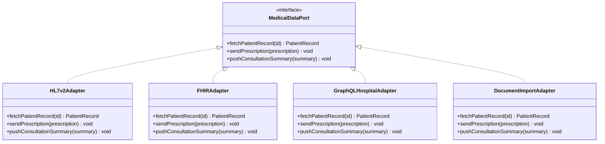
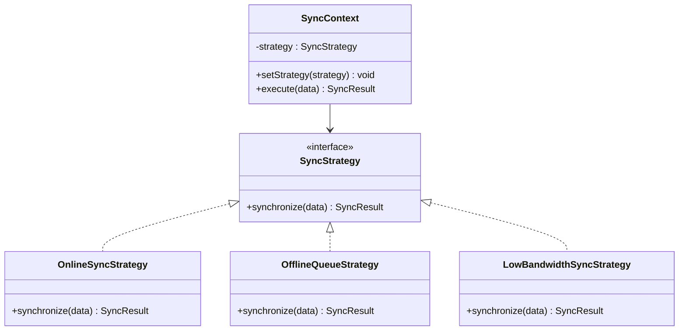
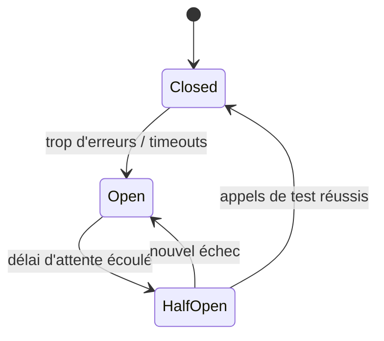
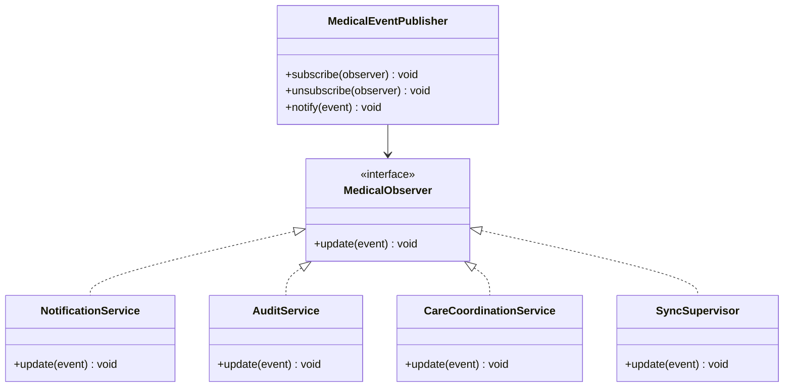

# Partie 3 — Design Patterns

> **Responsable** : _Membre 4 — Tech Lead_
> **Points** : 3/20

---

## Table des matières

- [1. Méthodologie d'identification](#1-méthodologie-didentification)
- [2. Problématiques et patterns retenus](#2-problématiques-et-patterns-retenus)
- [3. Pattern 1 — Adapter](#3-pattern-1--adapter)
- [4. Pattern 2 — Strategy](#4-pattern-2--strategy)
- [5. Pattern 3 — Circuit Breaker](#5-pattern-3--circuit-breaker)
- [6. Pattern 4 — Observer](#6-pattern-4--observer)
- [7. Synthèse](#7-synthèse)

---

## 1. Méthodologie d'identification

Les patterns n'ont pas été choisis à partir d'un catalogue théorique, mais à partir des difficultés explicitement citées dans le sujet. Quatre zones de risque ressortent nettement.

La première est l'interopérabilité avec des systèmes hospitaliers hétérogènes. Le sujet mentionne des échanges en HL7 v2, FHIR, GraphQL, ainsi que des flux plus dégradés autour de PDF ou de dossiers numérisés. Cette hétérogénéité impose un découplage fort entre le coeur métier et les protocoles externes.

La deuxième zone de risque est la connectivité variable. Le sujet insiste sur les zones à faible débit, le fonctionnement offline et la synchronisation différée. Le comportement attendu du système dépend donc du contexte réseau.

La troisième zone de risque est la résilience. Les appels aux systèmes tiers et aux structures de santé locales peuvent être indisponibles ou dégradés. Un simple mécanisme de retry ne suffit pas si l'on veut éviter les effets en cascade.

La quatrième zone de risque concerne les alertes et notifications médicales. Plusieurs acteurs doivent réagir à un même événement métier, par exemple la création d'une alerte patient, la mise à disposition d'un compte-rendu ou la détection d'un conflit de synchronisation.

Les patterns retenus répondent donc à des problèmes concrets et récurrents du projet, avec un objectif commun : protéger le domaine métier contre la variabilité des interfaces, des réseaux et des usages terrain.

## 2. Problématiques et patterns retenus

| # | Problématique concrète | Design Pattern | Catégorie | Impact principal |
|---|------------------------|----------------|-----------|------------------|
| 1 | Intégration avec les SI hospitaliers hétérogènes (HL7 v2, FHIR, GraphQL, documents numérisés) | Adapter | Structural | Interopérabilité et découplage |
| 2 | Connectivité variable selon la zone et l'état du réseau | Strategy | Behavioral | Adaptabilité et testabilité |
| 3 | Pannes réseau ou indisponibilité des services externes | Circuit Breaker | Behavioral | Résilience et protection des ressources |
| 4 | Diffusion d'événements médicaux vers plusieurs consommateurs | Observer | Behavioral | Découplage et réactivité |

## 3. Pattern 1 — Adapter

### Problématique

HealthRuralNet doit dialoguer avec plusieurs systèmes existants sans imposer un modèle unique aux hôpitaux et cliniques partenaires. Le sujet cite explicitement des SI en HL7 v2, d'autres déjà passés à FHIR, une minorité exposant des API GraphQL, ainsi que des flux issus de dossiers papier numérisés.

Le coeur métier de la plateforme ne peut pas dépendre de ces formats externes, sinon chaque évolution d'un partenaire casserait le système. Le risque serait de propager partout des conversions de formats, du code spécifique par établissement et des règles métier polluées par des considérations techniques d'intégration.

### Solution

Le pattern `Adapter` crée une interface commune côté HealthRuralNet, puis encapsule la logique propre à chaque source externe dans un adaptateur dédié. Le domaine manipule un `MedicalDataPort` stable, tandis que les adaptateurs traduisent les structures reçues vers le modèle interne.

### Justification

`Adapter` est plus pertinent qu'une simple `Facade`, car le problème n'est pas seulement de simplifier un sous-système complexe, mais bien de convertir plusieurs interfaces incompatibles vers un contrat interne unique.

Le pattern évite aussi de lier directement le domaine à HL7 ou FHIR. Un changement de partenaire local ou l'arrivée d'un nouvel établissement ne remet pas en cause les services métiers, il suffit d'ajouter ou de faire évoluer l'adaptateur correspondant.

Enfin, ce pattern facilite les tests. Le domaine peut être testé avec un faux `MedicalDataPort`, sans avoir à dépendre d'un SI hospitalier réel.

## 4. Pattern 2 — Strategy

### Problématique

Le sujet précise que la plateforme doit rester utilisable avec de la 4G, des réseaux intermittents, voire sans connexion temporairement. Une même fonctionnalité, comme l'envoi d'un compte-rendu ou la mise à jour d'un dossier patient, ne peut donc pas toujours suivre le même algorithme d'exécution.

En mode nominal, la donnée peut être transmise immédiatement. En mode dégradé, elle doit être stockée localement, puis resynchronisée plus tard. En mode faible bande passante, il peut être nécessaire de réduire les pièces jointes, de différer certains médias ou de transmettre uniquement les métadonnées critiques.

### Solution

Le pattern `Strategy` permet d'encapsuler plusieurs politiques de synchronisation interchangeables derrière une même interface. Le composant applicatif choisit la stratégie adaptée à l'état du réseau et au niveau de criticité de l'opération.

### Justification

Un simple `if/else` dispersé dans l'application deviendrait vite fragile, surtout si les règles évoluent en fonction du type de donnée, du réseau ou du terminal. `Strategy` centralise ces variantes et garde un code lisible.

Le pattern est ici plus adapté que `State`. Dans ce projet, ce n'est pas l'entité métier elle-même qui change de cycle de vie, mais l'algorithme de synchronisation choisi selon le contexte d'exécution.

Il améliore aussi la testabilité. Chaque stratégie peut être validée isolément avec des scénarios précis : connexion stable, perte de réseau, payload volumineux, reprise après coupure.

## 5. Pattern 3 — Circuit Breaker

### Problématique

HealthRuralNet dépend de services externes et d'infrastructures locales dont la disponibilité n'est pas garantie. Le sujet insiste sur la fragilité réseau en zone rurale et sur l'intégration avec des systèmes partenaires parfois anciens ou difficilement accessibles.

Si l'application continue à appeler agressivement un service indisponible, elle gaspille des ressources, augmente les temps d'attente et risque de dégrader toute la chaîne de traitement. Dans un contexte médical, cette situation peut retarder l'accès à une information importante ou bloquer inutilement l'interface d'un soignant.

### Solution

Le pattern `Circuit Breaker` surveille le taux d'échec d'une dépendance distante. Lorsque le seuil critique est atteint, il ouvre le circuit et coupe temporairement les appels. Le système renvoie alors une réponse dégradée contrôlée, par exemple une donnée en cache, un message clair ou une mise en file d'attente pour reprise ultérieure.

### Justification

Le `Circuit Breaker` est préférable à un simple mécanisme de retry. Un retry seul peut aggraver la congestion si le service distant est déjà en échec. Le breaker, lui, protège à la fois le consommateur et la dépendance distante.

Ce pattern est particulièrement cohérent avec le sujet, car il permet de combiner résilience et expérience utilisateur. Un médecin n'attend pas indéfiniment une réponse d'un hôpital tiers ; l'application peut afficher un état de synchronisation différée ou proposer une reprise ultérieure.

Il s'intègre naturellement à une architecture orientée services, notamment au niveau des connecteurs d'intégration, des passerelles d'API et des clients appelant des partenaires externes.

## 6. Pattern 4 — Observer

### Problématique

Une plateforme de télémédecine ne traite pas seulement des CRUD de dossiers. Elle doit aussi réagir à des événements métier : alerte d'urgence, nouveau compte-rendu, résultat d'examen disponible, conflit de synchronisation, rendez-vous replanifié, rappel de suivi.

Le sujet insiste sur le suivi patient, les alertes, la coordination des professionnels et la nécessité d'informer plusieurs profils aux attentes différentes. Si chaque émetteur appelle directement tous les récepteurs, le système devient fortement couplé et difficile à faire évoluer.

### Solution

Le pattern `Observer` permet à un producteur d'événements de notifier plusieurs abonnés sans connaître leur implémentation précise. Lorsqu'un événement médical survient, le système de notification, le module d'audit, le tableau de bord soignant ou le moteur de synchronisation peuvent réagir chacun de leur côté.

### Justification

`Observer` évite le couplage direct entre l'événement métier et tous ses consommateurs. L'ajout d'un nouveau traitement, par exemple une alerte vers un aidant familial ou une journalisation réglementaire supplémentaire, n'oblige pas à modifier le producteur initial.

Ce pattern est aussi cohérent avec une architecture événementielle évoquée dans le sujet. Il peut être implémenté en mémoire dans un service local, ou prolongé au niveau système par un broker de messages pour les événements inter-services.

Il faut toutefois garder une vigilance fonctionnelle : toutes les notifications médicales ne doivent pas être entièrement automatisées. Le pattern facilite la diffusion technique d'un événement, mais ne remplace pas les règles métier de validation humaine lorsque le contexte clinique l'exige.

## 7. Synthèse

Les quatre patterns se complètent et répondent chacun à un risque structurel du projet.

| Pattern | Zone d'application | Bénéfice principal | Risque maîtrisé |
|---------|--------------------|--------------------|-----------------|
| Adapter | Frontières d'intégration avec les SI externes | Uniformiser les échanges sans polluer le domaine | Hétérogénéité des formats |
| Strategy | Application mobile et moteur de synchronisation | Adapter l'algorithme au contexte réseau | Réseau instable et offline |
| Circuit Breaker | Connecteurs externes et clients inter-services | Empêcher les cascades de pannes | Timeouts et indisponibilités |
| Observer | Notifications, audit, coordination | Réagir à un événement sans couplage fort | Multiplication des consommateurs |

Pris ensemble, ces patterns renforcent la modularité, la maintenabilité et la robustesse de HealthRuralNet. Ils permettent surtout d'éviter deux erreurs classiques dans ce contexte : faire entrer les contraintes d'intégration directement dans le coeur métier, et gérer la variabilité réseau à coups de règles dispersées dans tout le code.

---

*HealthRuralNet — Evaluation Architecture Logicielle M1 — Mars 2026*
