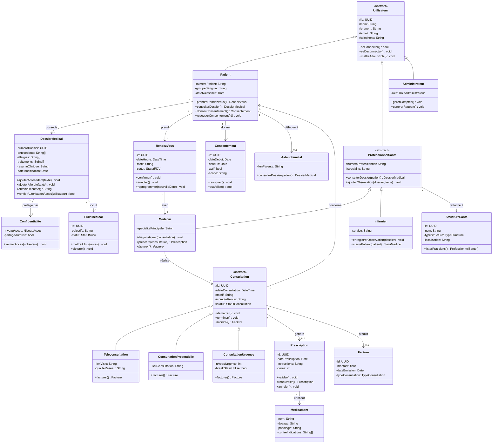

# Partie 4 — Conception du Modèle Métier

## 1. Objectif du modèle métier

Le modèle métier de **HealthRuralNet** a pour objectif de traduire les besoins fonctionnels du sujet en objets informatiques cohérents. Il doit représenter les acteurs, les données médicales, les échanges entre patients et soignants, ainsi que les contraintes de sécurité et d’organisation propres à une plateforme de télémédecine en zone rurale.

Le modèle a été conçu pour être :
- **cohérent avec les besoins métier**
- **évolutif**
- **modulaire**
- **maintenable**
- **compatible avec les exigences de confidentialité**

---

## 2. Diagramme de classes UML

### Diagramme de classes Mermaid (version inline)

---

## 3. Inventaire des entités métier

### 3.1 Entités principales

| Entité | Description | Attributs clés |
|---|---|---|
| `Utilisateur` | Classe abstraite représentant tout acteur connecté à la plateforme | id, nom, prenom, email, telephone |
| `Patient` | Personne prise en charge via la plateforme | numeroPatient, groupeSanguin |
| `ProfessionnelSante` | Classe abstraite regroupant les soignants | numeroProfessionnel, specialite |
| `Medecin` | Professionnel habilité à diagnostiquer et prescrire | specialite |
| `Infirmier` | Professionnel chargé du suivi et de certains actes de soin | specialite |
| `Administrateur` | Utilisateur chargé de gérer la plateforme | role |
| `DossierMedical` | Dossier centralisant les informations de santé du patient | numeroDossier, antecedents, traitements, allergies |
| `Consultation` | Classe abstraite représentant un acte médical | id, dateConsultation, motif, compteRendu |
| `RendezVous` | Élément de planification d’une future consultation | id, dateHeure, motif, statut |
| `Prescription` | Résultat éventuel d’une consultation médicale | id, datePrescription, instructions |
| `SuiviMedical` | Élément représentant la continuité des soins | id, objectifs, statut |
| `Consentement` | Autorisation donnée par le patient pour l’accès à ses données | id, dateDebut, dateFin, actif |
| `StructureSante` | Structure à laquelle sont rattachés les professionnels | id, nom, typeStructure |
| `Confidentialite` | Règles d’accès au dossier médical | niveauAcces, partageAutorise |
| `IdentifiantsSecurises` | Informations d’authentification d’un utilisateur | hashMotDePasse, secretMFA |

### 3.2 Entités secondaires identifiées

| Entité | Description | Justification |
|---|---|---|
| `AidantFamilial` | Personne pouvant accompagner le patient dans certaines démarches | utile pour les patients dépendants ou âgés |
| `Medicament` | Médicament présent dans une prescription | permet de détailler les prescriptions |
| `Facture` | Élément lié à la facturation d’une consultation | utile pour illustrer le polymorphisme de facturation |
| `Alerte` | Notification ou signal médical important | pertinent dans un système de suivi |
| `Notification` | Message envoyé à un utilisateur | utile pour les rappels de rendez-vous ou alertes |
| `DocumentMedical` | Fichier lié au dossier médical | utile pour ordonnances, comptes-rendus, examens |

---

## 4. Énumérations identifiées

Les énumérations permettent de limiter certaines valeurs possibles et de rendre le modèle plus robuste.

| Énumération | Valeurs possibles |
|---|---|
| `TypeConsultation` | Teleconsultation, Presentielle, Urgence |
| `StatutRDV` | Planifie, Confirme, Annule, Termine |
| `TypeStructure` | Hopital, Clinique, Cabinet, Dispensaire |
| `StatutConsultation` | EnAttente, EnCours, Terminee |
| `StatutSuivi` | Actif, Suspendu, Cloture |
| `NiveauAcces` | Lecture, LectureEcriture, Restreint |
| `RoleAdministrateur` | SuperAdmin, Gestionnaire, Support |

---

## 5. Description détaillée des classes

### `Utilisateur`
Classe abstraite servant de base à tous les acteurs du système. Elle factorise les attributs et comportements communs comme l’identité, les coordonnées et l’authentification.

### `Patient`
Spécialisation de `Utilisateur`. Il représente la personne prise en charge par la plateforme. Il peut prendre rendez-vous, consulter une partie de son dossier et gérer ses consentements.

### `ProfessionnelSante`
Classe abstraite spécialisée à partir de `Utilisateur`. Elle regroupe les éléments communs aux soignants, comme le numéro professionnel, la spécialité et la capacité à consulter un dossier médical.

### `Medecin`
Spécialisation de `ProfessionnelSante`. Il possède des responsabilités spécifiques, notamment le diagnostic et l’émission de prescriptions.

### `Infirmier`
Spécialisation de `ProfessionnelSante`. Il intervient davantage dans le suivi, les observations et l’accompagnement du patient.

### `Administrateur`
Spécialisation de `Utilisateur`. Il gère les comptes, les rôles et le fonctionnement général de la plateforme.

### `DossierMedical`
Classe centrale du domaine. Elle contient les informations médicales du patient : antécédents, traitements, allergies, résumé clinique. C’est une classe sensible qui impose un contrôle d’accès strict.

### `Confidentialite`
Classe associée au `DossierMedical`. Elle représente les règles de partage et d’autorisation d’accès aux données médicales.

### `IdentifiantsSecurises`
Classe dédiée à l’authentification. Elle isole les données sensibles de connexion du reste des informations utilisateur.

### `RendezVous`
Classe de planification. Elle représente un créneau prévu entre un patient et un professionnel de santé, indépendamment du fait que la consultation ait réellement lieu.

### `Consultation`
Classe abstraite représentant l’acte médical réalisé. Elle contient les éléments communs aux différents types de consultation.

### `Teleconsultation`
Sous-classe de `Consultation` adaptée au soin à distance. Elle ajoute la notion de lien visio.

### `ConsultationPresentielle`
Sous-classe de `Consultation` adaptée à une rencontre physique dans une structure de santé.

### `ConsultationUrgence`
Sous-classe de `Consultation` adaptée aux situations urgentes nécessitant une prise en charge prioritaire.

### `Prescription`
Classe représentant l’ordonnance ou les recommandations médicales produites à l’issue d’une consultation.

### `SuiviMedical`
Classe représentant la continuité de la prise en charge, notamment pour les pathologies chroniques ou la surveillance post-consultation.

### `Consentement`
Classe représentant l’accord donné par le patient pour le traitement ou l’accès à ses données médicales.

### `StructureSante`
Classe représentant les établissements ou organisations médicales auxquelles les professionnels sont rattachés.

---

## 6. Justification de l’héritage

L’héritage a été utilisé pour représenter les similarités entre plusieurs acteurs du système sans dupliquer les attributs et comportements communs.

Le choix d’une classe abstraite **`Utilisateur`** est justifié par le fait que tous les acteurs partagent :
- une identité
- des coordonnées
- des mécanismes de connexion
- des opérations de gestion de profil

Au lieu de répéter ces éléments dans `Patient`, `Medecin`, `Infirmier` ou `Administrateur`, ils sont factorisés dans une classe mère.

La classe abstraite **`ProfessionnelSante`** permet ensuite de factoriser ce qui est commun aux soignants :
- identifiant professionnel
- spécialité
- consultation du dossier médical
- rédaction de compte-rendu

### Avantages de ce choix
- réduction de la duplication
- meilleure lisibilité du modèle
- ajout plus simple de nouveaux types de professionnels
- meilleure maintenabilité

### Limites
L’héritage peut devenir rigide si les rôles évoluent fortement ou se combinent. Par exemple, un utilisateur pourrait cumuler plusieurs rôles dans certains contextes.

### Alternative possible
Une approche par **composition** aurait pu être utilisée, avec une classe `Utilisateur` associée à un ou plusieurs rôles. Cette solution serait plus flexible, mais aussi plus complexe à représenter et à expliquer dans ce modèle métier. Pour ce projet, l’héritage reste plus clair et plus adapté au rendu UML attendu.

---

## 7. Justification de l’encapsulation

L’encapsulation a été utilisée pour protéger les données sensibles et imposer un accès contrôlé aux informations critiques.

Le meilleur exemple est **`DossierMedical`**. Les attributs liés aux :
- antécédents
- allergies
- traitements
- informations cliniques

sont définis comme **privés** dans le diagramme. Ils ne peuvent donc pas être modifiés librement depuis l’extérieur.

L’accès se fait via des méthodes publiques comme :
- `ajouterAntecedent()`
- `ajouterTraitement()`
- `obtenirResume()`
- `verifierAutorisationAcces()`

Ce choix est cohérent avec les exigences du domaine :
- respect de la **confidentialité**
- conformité avec le **RGPD**
- protection contre des accès ou modifications non contrôlés
- centralisation des règles métier

L’encapsulation est aussi visible dans **`IdentifiantsSecurises`**, où les données liées à l’authentification sont isolées, et dans **`Confidentialite`**, qui gère les règles d’accès au dossier.

---

## 8. Justification du polymorphisme

Le polymorphisme est illustré principalement avec la hiérarchie de **`Consultation`**.

La classe abstraite `Consultation` définit un comportement commun avec la méthode :

- `facturer()`

Cette méthode est ensuite redéfinie dans :
- `Teleconsultation`
- `ConsultationPresentielle`
- `ConsultationUrgence`

Le comportement varie selon le type réel de consultation. Une urgence, une consultation physique ou une téléconsultation ne suivent pas forcément les mêmes règles de gestion ou de coût.

### Intérêt de ce choix
- facilite l’évolution du système
- évite des conditions `if / else` trop nombreuses
- permet d’ajouter facilement de nouveaux types de consultation
- respecte le principe ouvert/fermé

### Autres cas possibles de polymorphisme
- `seConnecter()` selon le mode d’authentification
- `envoyerNotification()` selon le canal utilisé (email, SMS, application)
- `calculerPriorite()` selon le type de suivi ou d’alerte

---

## 9. Justification des associations, compositions et agrégations

### Association
Une **association** est utilisée lorsqu’il existe un lien métier entre deux classes, sans relation forte de cycle de vie.

Exemples :
- un `Patient` prend des `RendezVous`
- un `ProfessionnelSante` réalise des `Consultation`
- un `Medecin` émet des `Prescription`

### Composition
Une **composition** est utilisée lorsqu’un objet ne peut pas exister de manière cohérente sans un autre.

Exemples :
- un `Patient` possède exactement un `DossierMedical`
- un `Utilisateur` possède ses `IdentifiantsSecurises`
- un `DossierMedical` possède sa `Confidentialite`

Dans ces cas, la suppression de l’objet principal entraîne logiquement la disparition de l’objet contenu ou de sa pertinence métier.

### Agrégation
Une **agrégation** pourrait être utilisée dans des cas plus souples, par exemple entre `StructureSante` et `ProfessionnelSante`, car un professionnel appartient à une structure mais reste un objet métier indépendant.

---

## 10. Cardinalités et règles de gestion

### Cardinalités principales
- un `Patient` possède **exactement un** `DossierMedical`
- un `Patient` peut avoir **0 à plusieurs** `RendezVous`
- un `Patient` peut avoir **0 à plusieurs** `Consultation`
- un `ProfessionnelSante` peut assurer **0 à plusieurs** `Consultation`
- une `Consultation` peut produire **0 à plusieurs** `Prescription`
- un `Patient` peut donner **0 à plusieurs** `Consentement`
- une `StructureSante` regroupe **0 à plusieurs** `ProfessionnelSante`

### Invariants métier
- un patient ne peut avoir qu’un seul dossier médical principal
- une prescription ne peut être émise que par un médecin
- une consultation est liée à un patient et à un professionnel de santé
- un rendez-vous peut exister sans consultation effective
- l’accès au dossier médical doit être contrôlé
- les données médicales sensibles ne sont jamais exposées directement

---

## 11. Cohérence avec les besoins et l’architecture

Ce modèle métier est cohérent avec :
- les besoins de consultation à distance
- le suivi patient
- la sécurisation des données médicales
- l’organisation des rendez-vous
- l’intégration des professionnels et structures de santé

Il est également compatible avec une architecture modulaire ou orientée services, car les objets métier sont bien séparés et les responsabilités clairement réparties.

---

## 12. Conclusion

Le diagramme de classes proposé constitue une base métier cohérente pour **HealthRuralNet**. Il couvre les principales entités du domaine, distingue les rôles et responsabilités, et intègre les concepts fondamentaux de la programmation orientée objet.

Les choix de conception sont justifiés de la manière suivante :
- **héritage** pour factoriser les éléments communs et spécialiser les rôles
- **encapsulation** pour protéger les données sensibles et contrôler les accès
- **polymorphisme** pour adapter le comportement selon le type d’objet manipulé
- **associations, compositions et cardinalités** pour représenter fidèlement les relations métier

L’ensemble garantit un modèle **lisible**, **maintenable**, **évolutif** et adapté à une plateforme de télémédecine soumise à de fortes contraintes métier et réglementaires.