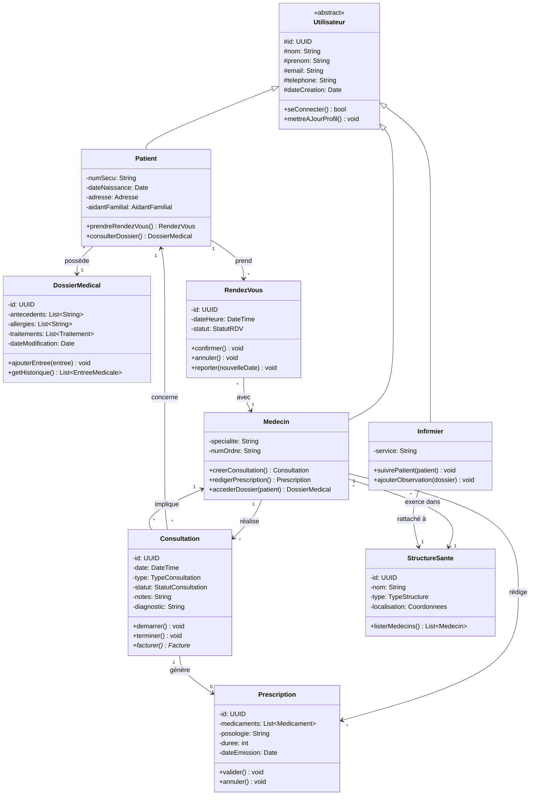

# Partie 4 — Conception du Modèle Métier

> **Responsable** : _Membre 3 — Concepteur Domaine Métier_
> **Points** : 4/20

---

## Table des matières

- [1. Identification des entités métier](#1-identification-des-entités-métier)
- [2. Diagramme de classes UML](#2-diagramme-de-classes-uml)
- [3. Justification des concepts POO](#3-justification-des-concepts-poo)
- [4. Description détaillée des classes](#4-description-détaillée-des-classes)
- [5. Relations et cardinalités](#5-relations-et-cardinalités)

---

## 1. Identification des entités métier

<!-- Liste des entités principales du domaine HealthRuralNet -->

| Entité | Description | Attributs clés |
|--------|-------------|----------------|
| Utilisateur | Classe abstraite parente | id, nom, email, dateCreation |
| Patient | Utilisateur bénéficiaire de soins | numSecu, dateNaissance, adresse |
| Medecin | Professionnel de santé | specialite, numOrdre, structureSante |
| Infirmier | Personnel soignant | service, structureSante |
| DossierMedical | Dossier patient sécurisé | antecedents, allergies, traitements |
| Consultation | Séance de télémédecine | date, type, statut, notes |
| Prescription | Ordonnance médicale | medicaments, posologie, duree |
| StructureSante | Hôpital, clinique, dispensaire | nom, type, localisation |
| RendezVous | Planification de consultation | date, heure, medecin, patient |

## 2. Diagramme de classes UML

## 3. Justification des concepts POO

### 3.1 Héritage

<!-- Utilisateur → Patient, Medecin, Infirmier : justification du choix d'héritage -->

### 3.2 Encapsulation

<!-- Protection des attributs sensibles de DossierMedical (antécédents, allergies) — attributs privés, accès contrôlé -->

### 3.3 Polymorphisme

<!-- Méthode facturer() sur Consultation : comportement différent selon TypeConsultation (urgence, suivi, spécialiste) -->

## 4. Description détaillée des classes

<!-- Description de chaque classe avec ses responsabilités, invariants métier, règles de gestion -->

## 5. Relations et cardinalités

<!-- Justification des associations, compositions et agrégations choisies -->

---

*HealthRuralNet — Evaluation Architecture Logicielle M1 — Mars 2026*
