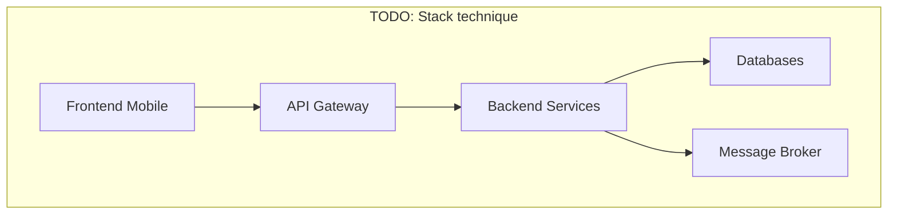

# Partie 5 — Pile Technique Complète

> **Responsable** : _Membre 4 — Tech Lead_
> **Points** : 2/20

---

## Table des matières

- [1. Vue d'ensemble](#1-vue-densemble)
- [2. Langages et frameworks](#2-langages-et-frameworks)
- [3. Base de données](#3-base-de-données)
- [4. Infrastructure et déploiement](#4-infrastructure-et-déploiement)
- [5. Outils de test](#5-outils-de-test)
- [6. Outils de gestion de projet](#6-outils-de-gestion-de-projet)
- [7. Surveillance et qualité de code](#7-surveillance-et-qualité-de-code)
- [8. Environnements de développement](#8-environnements-de-développement)

---

## 1. Vue d'ensemble

<!-- Schéma global de la stack technique -->

## 2. Langages et frameworks

| Couche | Technologie | Justification |
|--------|-------------|---------------|
| Frontend Mobile | | |
| Frontend Web | | |
| Backend API | | |
| API Gateway | | |

## 3. Base de données

| Type | Technologie | Usage | Justification |
|------|-------------|-------|---------------|
| Relationnelle | | | |
| Document | | | |
| Cache | | | |

## 4. Infrastructure et déploiement

<!-- Cloud, conteneurisation, CI/CD, orchestration -->

| Outil | Usage | Justification |
|-------|-------|---------------|
| | | |

## 5. Outils de test

| Type de test | Outil | Justification |
|-------------|-------|---------------|
| Unitaire | | |
| Intégration | | |
| E2E | | |
| Charge | | |

## 6. Outils de gestion de projet

| Outil | Usage | Justification |
|-------|-------|---------------|
| | | |

## 7. Surveillance et qualité de code

| Outil | Usage | Justification |
|-------|-------|---------------|
| Analyse statique | | |
| Monitoring | | |
| Logging | | |

## 8. Environnements de développement

| IDE / Outil | Usage | Justification |
|-------------|-------|---------------|
| | | |

---

*HealthRuralNet — Evaluation Architecture Logicielle M1 — Mars 2026*
