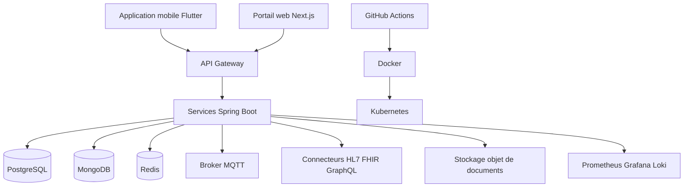

# Partie 5 — Pile Technique Complète

> **Responsable** : _Membre 4 — Tech Lead_
> **Points** : 2/20

---

## Table des matières

- [1. Vue d'ensemble](#1-vue-densemble)
- [2. Langages et frameworks](#2-langages-et-frameworks)
- [3. Base de données](#3-base-de-données)
- [4. Infrastructure et déploiement](#4-infrastructure-et-déploiement)
- [5. Outils de test](#5-outils-de-test)
- [6. Outils de gestion de projet](#6-outils-de-gestion-de-projet)
- [7. Surveillance et qualité de code](#7-surveillance-et-qualité-de-code)
- [8. Environnements de développement](#8-environnements-de-développement)

---

## 1. Vue d'ensemble

La pile technique proposée privilégie la robustesse, l'interopérabilité et la sobriété. Le sujet évoque beaucoup d'idées exploratoires, comme la blockchain, un chiffrement maison ou des assistants intelligents très ambitieux. Ces pistes ne sont pas retenues dans le socle initial, car elles augmenteraient la complexité sans résoudre les priorités du projet : consultation à distance, suivi patient, sécurité, interconnexion et fonctionnement en connectivité dégradée.

Le choix retenu repose donc sur un coeur transactionnel fiable, une couche d'intégration standardisée, un support explicite du mode offline et un outillage de qualité adapté à une plateforme de santé.

## 2. Langages et frameworks

| Couche | Technologie | Justification |
|--------|-------------|---------------|
| Frontend Mobile | Flutter + Dart | Une application mobile dédiée est pertinente pour les zones rurales, avec un vrai support offline, une bonne maîtrise du stockage local et de bonnes performances sur terminaux modestes. Flutter permet de cibler Android et iOS avec une base unique tout en restant plus fluide qu'une simple interface web encapsulée. |
| Frontend Web | Next.js + TypeScript | Le portail web est utile pour les praticiens, coordinateurs et administrateurs travaillant depuis poste fixe. TypeScript réduit les erreurs d'interface, et Next.js apporte une structure claire, un routage mature et un bon écosystème pour les formulaires complexes. |
| Backend API | Java 21 + Spring Boot 3 | Le domaine santé demande une stack stable, outillée et fortement typée. Spring Boot est mature pour la sécurité, la validation, les APIs REST, les intégrations et l'observabilité. Ce choix est cohérent avec une architecture en services et avec des patterns de résilience comme Circuit Breaker. |
| API Gateway | Spring Cloud Gateway | Le gateway centralise l'authentification, le routage, le rate limiting et l'exposition des APIs sans disperser ces responsabilités dans chaque service. |
| Intégration SI | HAPI FHIR, bibliothèques HL7, clients GraphQL | Le sujet impose une interopérabilité forte. Il faut s'appuyer sur des standards et bibliothèques éprouvés plutôt que créer un format ou un protocole propriétaire. |

## 3. Base de données

| Type | Technologie | Usage | Justification |
|------|-------------|-------|---------------|
| Relationnelle | PostgreSQL | Dossiers patients structurés, rendez-vous, prescriptions, comptes utilisateurs, traçabilité transactionnelle | Le coeur du système est fortement structuré, avec contraintes d'intégrité et besoin de transactions fiables. PostgreSQL est robuste, open source et bien adapté à ce type de charge. |
| Document | MongoDB | Payloads d'intégration semi-structurés, journaux techniques d'échange, métadonnées issues de connecteurs externes | Le sujet impose de composer avec des formats hétérogènes. Une base documentaire est utile pour absorber des structures variables sans rigidifier inutilement le modèle relationnel du coeur métier. |
| Cache | Redis | Cache de session, tokens temporaires, réponses fréquentes, verrous courts, files techniques légères | Redis réduit la latence sur les accès fréquents et aide à absorber les pics sans dégrader la base principale. |
| Stockage objet | S3 compatible ou MinIO | Documents numérisés, pièces jointes, comptes-rendus PDF, imagerie légère | Les documents binaires ne doivent pas être stockés dans la base transactionnelle. Un stockage objet facilite la montée en charge et la séparation des responsabilités. |

## 4. Infrastructure et déploiement

| Outil | Usage | Justification |
|-------|-------|---------------|
| Docker | Conteneurisation des services | Garantit la reproductibilité entre développement, intégration et production. |
| Kubernetes | Orchestration en production | Adapté à une architecture composée de plusieurs services, permet le redémarrage automatique, le scaling et une meilleure isolation des composants. |
| GitHub Actions | CI/CD | Le dépôt et les issues sont déjà gérés sur GitHub. Centraliser lint, tests, build et déploiement au même endroit réduit la friction d'équipe. |
| Helm | Déploiement des services sur Kubernetes | Rend les déploiements versionnés, paramétrables et reproductibles. |
| OVHcloud / cloud souverain compatible | Hébergement principal | Le sujet soulève des contraintes réglementaires et de souveraineté. Un hébergement compatible avec ces exigences est plus cohérent qu'un cloud générique choisi uniquement pour sa popularité. |
| MQTT Broker (EMQX ou Mosquitto) | Synchronisation différée et messages légers | Le sujet évoque explicitement MQTT pour les environnements réseau instables. Ce choix est pertinent pour des échanges légers entre clients en mobilité et backend. |

## 5. Outils de test

| Type de test | Outil | Justification |
|-------------|-------|---------------|
| Unitaire backend | JUnit 5 + Mockito | Standard solide pour tester services, règles métier et adaptateurs en Java. |
| Unitaire frontend web | Vitest + React Testing Library | Rapide à exécuter et adapté aux composants TypeScript/React. |
| Unitaire mobile | `flutter test` | Couvre la logique applicative et les comportements hors ligne côté mobile. |
| Intégration | Testcontainers | Permet de tester les services avec PostgreSQL, Redis ou MongoDB réels sans dépendre d'une plateforme externe fragile. |
| API | Postman/Newman ou Rest Assured | Vérifie les contrats d'API et les scénarios d'échange entre clients et services. |
| E2E web | Playwright | Vérifie les parcours critiques comme la connexion, la consultation de dossier ou la prise de rendez-vous. |
| E2E mobile | `integration_test` Flutter | Vérifie les parcours critiques sur mobile, notamment les scénarios de reprise réseau. |
| Charge | k6 | Léger, scriptable et suffisant pour tester la tenue de la plateforme lors de campagnes de consultation ou de pics d'usage. |

## 6. Outils de gestion de projet

| Outil | Usage | Justification |
|-------|-------|---------------|
| GitHub Issues | Découpage du travail | Déjà utilisé dans ce projet, simple et suffisant pour suivre les livrables et les tâches. |
| GitHub Projects | Pilotage visuel | Permet de suivre l'avancement par statut et par membre sans multiplier les outils. |
| Pull Requests GitHub | Relecture croisée | Utile pour imposer une validation avant intégration, ce qui réduit les incohérences documentaires et techniques. |
| Markdown + Mermaid | Documentation versionnée | Permet de garder diagrammes et textes dans le dépôt, donc dans le même cycle de revue que le reste du travail. |
| ADR légères | Traçabilité des décisions techniques | Le sujet impose des choix justifiés. Des Architecture Decision Records courtes rendent ces arbitrages explicites et auditables. |

## 7. Surveillance et qualité de code

| Outil | Usage | Justification |
|-------|-------|---------------|
| Analyse statique | SonarQube | Mesure dette technique, duplications, couverture et vulnérabilités potentielles, ce qui est essentiel sur une plateforme manipulant des données sensibles. |
| Linting | ESLint, Prettier, Checkstyle | Uniformise le code et réduit les écarts de style entre les technologies utilisées. |
| Monitoring | Prometheus + Grafana | Couple éprouvé pour surveiller disponibilité, latence, taux d'erreur et saturation des services. |
| Logging | Loki + Grafana | Plus léger qu'une pile ELK complète et suffisant pour centraliser les logs applicatifs et d'infrastructure. |
| Traçage distribué | OpenTelemetry | Important pour suivre un dossier ou une requête à travers gateway, services et connecteurs externes. |
| Crash reporting frontend | Sentry | Pertinent pour détecter rapidement les erreurs côté web et mobile, notamment sur des environnements terrain variés. |

## 8. Environnements de développement

| IDE / Outil | Usage | Justification |
|-------------|-------|---------------|
| IntelliJ IDEA | Développement backend Java | Très adapté à Spring Boot, à la navigation dans les services et au refactoring. |
| Visual Studio Code | Frontend web, documentation, scripts | Léger, polyvalent et bien outillé pour TypeScript, Markdown et Mermaid. |
| Android Studio | Tests et debug mobile Android | Nécessaire pour émulateurs, profils de performance et intégration mobile. |
| Xcode | Build et tests iOS | Indispensable si l'application Flutter cible aussi les terminaux Apple. |
| Docker Desktop | Exécution locale des dépendances | Permet de lancer rapidement bases, broker et services en environnement proche de la production. |

En synthèse, cette pile technique cherche un équilibre entre ambition et réalisme. Elle permet d'adresser les besoins structurants du sujet sans tomber dans la surenchère technologique. Le principe directeur est simple : standards ouverts, composants éprouvés, support explicite du mode dégradé, et outillage de qualité suffisant pour faire évoluer la plateforme dans la durée.

---

*HealthRuralNet — Evaluation Architecture Logicielle M1 — Mars 2026*
