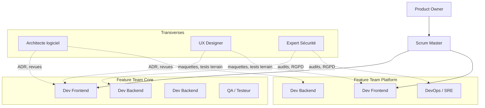

# Partie 6 — Planification et Composition de l'Équipe

> **Responsable** : _Membre 1 — Analyste & Chef de Projet_
> **Points** : 2/20

---

## Table des matières

- [1. Organisation globale](#1-organisation-globale)
- [2. Composition de l'équipe type](#2-composition-de-léquipe-type)
- [3. Rôles et responsabilités](#3-rôles-et-responsabilités)
- [4. Compétences spécifiques requises](#4-compétences-spécifiques-requises)
- [5. Prestataires externes](#5-prestataires-externes)
- [6. Justification des choix organisationnels](#6-justification-des-choix-organisationnels)

---

## 1. Organisation globale

### 1.1 Méthodologie : Scrum adapté

HealthRuralNet adopte une approche **Scrum** avec des sprints de **2 semaines**, adaptée aux contraintes du projet :

- **Daily standups** (15 min) pour synchroniser les équipes techniques et médicales — le sujet mentionne des problèmes de communication entre ces deux mondes.
- **Sprint Review** avec démonstration aux représentants médicaux — pour garantir l'adoption par les praticiens dès la phase de développement.
- **Sprint Retrospective** systématique — pour itérer sur les processus et réduire les frictions internes décrites dans le sujet.
- **Backlog refinement** bi-hebdomadaire avec le Product Owner et un référent médical pour maintenir l'alignement métier/technique.

### 1.2 Organisation en feature teams

Plutôt qu'une organisation en silos (front/back/ops), l'équipe est structurée en **2 feature teams** pluridisciplinaires :

| Feature Team | Périmètre | Composition |
| ------------ | --------- | ----------- |
| **Team Core** | Consultation, Dossier Médical, Prescription, Patient | 1 dev frontend + 2 dev backend + 1 QA |
| **Team Platform** | Auth, Notification, Interopérabilité, Sync/Offline | 1 dev frontend + 1 dev backend + 1 DevOps |

Les rôles transversaux (architecte, UX, sécurité) interviennent sur les deux teams.

## 2. Composition de l'équipe type

### 2.1 Effectif total : 12 personnes

| Rôle | Nombre | Justification |
| ---- | ------ | ------------- |
| **Product Owner** | 1 | Interface entre les parties prenantes (praticiens, institutions, patients) et l'équipe technique. Priorise le backlog en fonction de l'impact médical. |
| **Scrum Master** | 1 | Facilite les sprints, lève les blocages, garant du processus Scrum. Rôle critique vu les tensions inter-équipes décrites dans le sujet. |
| **Développeur Frontend** | 2 | PWA mobile-first (Flutter) + application web (Next.js). 2 développeurs nécessaires car le mode offline implique une logique client-side complexe (cache local, sync). |
| **Développeur Backend** | 3 | 8 microservices Spring Boot à développer et maintenir. 3 développeurs permettent une répartition de 2-3 services par personne, avec rotation pour éviter les silos de connaissance. |
| **Architecte logiciel** | 1 | Garant de la Clean Architecture, rédige les ADR, valide les contrats d'interface entre services. Rôle essentiel pour ne pas reproduire "l'empilement chaotique" décrit dans le sujet. |
| **DevOps / SRE** | 1 | Pipeline CI/CD, conteneurisation Docker/K8s, monitoring Prometheus/Grafana, déploiement multi-région (stockage souverain). |
| **Testeur / QA** | 1 | Tests E2E, tests de charge, tests de sécurité (OWASP). Validation des parcours offline et des scénarios de sync/conflit. |
| **UX Designer** | 1 | Interfaces simplifiées pour patients peu technophiles, tests utilisateurs terrain, accessibilité WCAG 2.1 AA, support multilingue. |
| **Expert Sécurité** | 1 | Chiffrement E2E, conformité RGPD/HIPAA, audits de sécurité, gestion des permissions RBAC, supervision du break-glass access. |

### 2.2 Diagramme de l'organisation

## 3. Rôles et responsabilités

### 3.1 Product Owner

- Maintient et priorise le backlog produit en collaboration avec les référents médicaux
- Arbitre les demandes contradictoires (le sujet décrit des attentes "parfois farfelues" venant de différents départements)
- Définit les critères d'acceptation de chaque user story
- Valide les releases avec les partenaires institutionnels

### 3.2 Scrum Master

- Anime les cérémonies Scrum (daily, planning, review, retro)
- Identifie et lève les blocages — rôle critique vu les problèmes de communication interne décrits dans le sujet
- Protège l'équipe des interruptions et des demandes non planifiées
- Fait le lien entre les feature teams Core et Platform

### 3.3 Architecte logiciel

- Garant de la Clean Architecture et du découpage microservices (cf. Part 2)
- Rédige les Architecture Decision Records (ADR) pour chaque décision significative (cf. Part 7)
- Valide les contrats d'interface entre services (API REST, événements)
- Revue de code sur les changements impactant l'architecture
- Accompagne les développeurs dans l'application des design patterns (Adapter, Strategy, Circuit Breaker, Observer — cf. Part 3)

### 3.4 Expert Sécurité

- Définit et maintient les politiques de chiffrement (TLS 1.3, AES-256, mTLS)
- Supervise l'implémentation du RBAC contextuel et du break-glass access
- Conduit les audits de conformité RGPD/HIPAA
- Valide les mécanismes de consentement patient et de délégation aidant
- Coordonne avec les prestataires externes de cybersécurité

## 4. Compétences spécifiques requises

Le projet HealthRuralNet nécessite des compétences pointues dans plusieurs domaines :

| Domaine | Compétences requises | Criticité | Disponibilité interne |
| ------- | -------------------- | --------- | --------------------- |
| **Interopérabilité médicale** | Standards HL7 v2, FHIR R4, mapping de données médicales | Haute | Non — compétence rare |
| **Sécurité données de santé** | RGPD, HIPAA, chiffrement, audit sécurité, pentesting | Haute | Partielle (1 expert interne) |
| **Mode offline / sync** | CRDT, event sourcing, résolution de conflits, SQLCipher | Haute | Partielle (à former) |
| **UX santé / accessibilité** | Design inclusif, WCAG 2.1, tests utilisateurs terrain, multilingue | Moyenne | Non |
| **Infrastructure cloud souverain** | OVHcloud, conformité hébergement données de santé (HDS) | Moyenne | Partielle (DevOps) |
| **Data Science / Épidémiologie** | Analyse de données médicales anonymisées, ML | Basse (phase 2) | Non |

## 5. Prestataires externes

Pour les compétences absentes en interne, le recours à des prestataires spécialisés est nécessaire :

| Prestataire | Expertise | Périmètre d'intervention | Durée estimée | Justification |
| ----------- | --------- | ------------------------ | ------------- | ------------- |
| **Cabinet d'audit cybersécurité** | Pentesting, audit RGPD/HIPAA, certification HDS | Audit initial + audit trimestriel | Ponctuel (4x/an) | Les données médicales exigent un niveau de sécurité vérifié par des tiers indépendants — l'auto-évaluation est insuffisante pour la conformité réglementaire. |
| **Consultant interopérabilité HL7/FHIR** | Standards médicaux, mapping HL7 v2 ↔ FHIR, intégration SI hospitaliers | Conception et implémentation du Service Interopérabilité | 3-6 mois | Compétence très spécialisée, marché tendu. Former un développeur interne prendrait trop de temps pour le MVP. |
| **Consultant RGPD / DPO externe** | Droit des données de santé, CNIL, consentement patient | Mise en conformité initiale + accompagnement continu | Continu (temps partiel) | Obligation légale d'avoir un DPO. Un DPO externe est plus réaliste qu'un recrutement à temps plein pour une structure de cette taille. |
| **Agence UX spécialisée santé** | Design inclusif, tests terrain zones rurales, accessibilité | Conception des interfaces patient et praticien | 2-3 mois (phase initiale) | Les utilisateurs finaux (patients ruraux, peu technophiles) nécessitent une approche UX spécifique que les développeurs seuls ne peuvent pas garantir. |
| **Expert performance / scalabilité** | Tests de charge, optimisation, architecture distribuée | Audit de performance avant chaque montée en charge | Ponctuel | Garantir les SLO (latence < 500ms, uptime > 99.5%) avant le déploiement régional. |

## 6. Justification des choix organisationnels

### 6.1 Pourquoi 12 personnes ?

Le dimensionnement repose sur le périmètre technique identifié :
- **8 microservices** à développer et maintenir → minimum 3 développeurs backend
- **2 clients** (PWA mobile + web) avec logique offline complexe → 2 développeurs frontend
- **Conformité réglementaire** (RGPD, HIPAA, HDS) → 1 expert sécurité dédié obligatoire
- **Problèmes de communication** interne décrits dans le sujet → 1 Scrum Master dédié, pas un rôle cumulé

Une équipe plus petite créerait des goulots d'étranglement (un seul dev backend = 8 services à maintenir seul). Une équipe plus grande introduirait des coûts de coordination disproportionnés pour un MVP.

### 6.2 Pourquoi Scrum ?

- **Itérations courtes** (2 semaines) → feedback rapide des praticiens, essentiel pour l'adoption
- **Transparence** → les sprint reviews avec les parties prenantes médicales réduisent les incompréhensions décrites dans le sujet
- **Adaptabilité** → le backlog peut être repriorisé à chaque sprint selon les retours terrain
- SAFe a été écarté : trop lourd pour une équipe de 12 personnes, conçu pour des organisations de 50+ développeurs

### 6.3 Pourquoi externaliser ?

Les 5 prestations externes identifiées répondent à un principe simple : **ne pas internaliser les compétences rares et ponctuelles**.

- L'audit cybersécurité *doit* être externe (indépendance requise par les régulateurs)
- L'expertise HL7/FHIR est trop rare pour recruter à temps plein — un consultant de 3-6 mois suffit pour former l'équipe interne
- Le DPO externe est un modèle courant et légalement accepté pour les structures de taille moyenne

### 6.4 Montée en charge progressive

| Phase | Durée | Équipe | Objectif |
| ----- | ----- | ------ | -------- |
| **MVP** | 6 mois | 12 personnes (core team) | Services core (Consultation, Dossier Médical, Auth, Sync) + 1 région pilote |
| **Extension** | 6 mois | +2 dev backend, +1 dev frontend | Tous les services + 3 régions |
| **Scale** | 12 mois | +1 SRE, +1 data scientist | Déploiement national + analytique épidémiologique |

---

*HealthRuralNet — Evaluation Architecture Logicielle M1 — Mars 2026*
