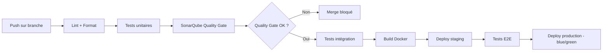

# Partie 7 — Maintenabilité, Évolutivité et Dette Technique

> **Responsable** : _Membre 2 — Architecte Système_
> **Points** : 1/20

---

## Table des matières

- [1. Stratégie de maintenabilité](#1-stratégie-de-maintenabilité)
- [2. Évolutivité du système](#2-évolutivité-du-système)
- [3. Gestion de la dette technique](#3-gestion-de-la-dette-technique)
- [4. Outils et métriques de qualité](#4-outils-et-métriques-de-qualité)
- [5. Bonnes pratiques pour un service durable](#5-bonnes-pratiques-pour-un-service-durable)

---

## 1. Stratégie de maintenabilité

### 1.1 Principes de développement

L'ensemble de l'équipe s'engage sur des principes de code qui garantissent la lisibilité et la maintenabilité à long terme.

| Principe | Application dans HealthRuralNet | Bénéfice |
| -------- | ------------------------------- | -------- |
| **Clean Code** | Nommage explicite (ex. : `createPrescription()` pas `doAction()`), fonctions courtes à responsabilité unique, pas de code mort | Lisibilité immédiate pour tout nouveau développeur rejoignant le projet |
| **SOLID** | Chaque microservice respecte le Single Responsibility Principle. L'Open/Closed est appliqué via les Adapters (HL7, FHIR) — ajout de formats sans modifier le code existant. Le Dependency Inversion est natif dans la Clean Architecture (le domaine ne dépend pas de l'infra). | Évolutivité : ajouter un canal SMS ou un adaptateur FHIR R5 ne casse rien |
| **DRY** | Les règles métier partagées (validation de données patient, calcul de posologie) sont centralisées dans des librairies internes versionées | Pas de duplication de logique critique entre services |
| **KISS** | Choix pragmatiques : RabbitMQ plutôt que Kafka, RBAC plutôt qu'ABAC, LWW plutôt que CRDT (cf. Part 2) | Complexité maîtrisée — chaque choix vise le juste nécessaire |

### 1.2 Documentation et versioning

| Type de documentation | Outil / Format | Fréquence de mise à jour |
| --------------------- | -------------- | ------------------------ |
| **ADR (Architecture Decision Records)** | Fichiers Markdown dans `docs/adr/` suivant le template MADR | À chaque décision architecturale significative |
| **Documentation API** | OpenAPI 3.0 (Swagger) générée automatiquement depuis le code | À chaque modification d'endpoint |
| **Glossaire métier** | Markdown partagé entre équipes tech et médicales | Continu — résout le problème de communication interne décrit dans le sujet |
| **Runbook opérationnel** | Wiki interne avec procédures d'incident | Après chaque incident résolu |

**Pourquoi les ADR ?** Le sujet décrit un historique de décisions technologiques mal documentées (passage de Skype à SaaS puis solution propre). Les ADR évitent de reproduire cette erreur : chaque décision est datée, contextualisée, et ses alternatives sont tracées. Un développeur arrivant dans 2 ans comprend *pourquoi* RabbitMQ a été choisi plutôt que Kafka.

### 1.3 Revues de code

| Pratique | Règle | Justification |
| -------- | ----- | ------------- |
| **Pull Request obligatoire** | Aucun merge sans 1 review minimum | Déjà appliqué sur ce repo (branch protection `main`) |
| **Revue croisée inter-services** | Si un changement impacte un contrat d'API, review par l'équipe du service consommateur | Évite les régressions silencieuses dans l'architecture microservices |
| **Checklist de review** | Sécurité (pas de données sensibles en clair), tests (couverture non régressive), cohérence (respect des ADR) | Standardise la qualité des reviews |

## 2. Évolutivité du système

L'architecture est conçue dès le départ pour absorber les évolutions identifiées dans le sujet (wearables, IA, nouveaux pays, nouveaux standards médicaux).

### 2.1 Patterns favorisant l'évolutivité

| Pattern | Rôle dans l'évolutivité | Exemple concret |
| ------- | ----------------------- | --------------- |
| **Clean Architecture** (Part 2, §2.3) | Le domaine métier est isolé de l'infrastructure — changer de techno ne touche pas la logique métier | Migrer de PostgreSQL à CockroachDB ne modifie que l'adaptateur de persistance |
| **Adapter** (Part 3) | Ajouter un nouveau format d'interopérabilité = écrire un nouvel adaptateur | Quand un hôpital passe de HL7 v2 à FHIR R5, on ajoute un `FHIRR5Adapter` sans toucher aux autres |
| **Strategy** (Part 3) | Ajouter un nouveau mode de synchronisation = écrire une nouvelle stratégie | Si la 5G arrive en zone rurale, on ajoute une `HighBandwidthSyncStrategy` |
| **Observer** (Part 3) | Ajouter un nouveau consommateur d'événements = s'abonner au broker | Intégrer un futur service d'analytique IA = un nouveau subscriber, zéro modification des services existants |

### 2.2 Contrats d'interface et versioning d'API

- **Versioning sémantique** des API REST (`/api/v1/`, `/api/v2/`) pour permettre la coexistence de versions
- **Consumer-Driven Contract Testing** : chaque service consommateur définit ses attentes dans un contrat. Si le producteur casse le contrat, les tests échouent avant le déploiement.
- **Événements versionnés** : les événements dans le broker portent un numéro de version (`PrescriptionCreated.v2`). Les anciens consommateurs continuent de fonctionner avec `v1` pendant la migration.

## 3. Gestion de la dette technique

### 3.1 Prévention dès la conception

La dette technique naît souvent de décisions prises sous pression. Le sujet le montre : des outils adoptés en urgence (Skype, SaaS) sont devenus des impasses. Pour prévenir :

- **ADR systématiques** : toute décision rapide est documentée avec ses compromis. La dette est consciente et traçable, jamais invisible.
- **Règle du Boy Scout** : chaque développeur laisse le code dans un meilleur état qu'il ne l'a trouvé. Les micro-améliorations continues évitent l'accumulation.
- **Definition of Done** incluant : tests unitaires, pas de warning SonarQube bloquant, documentation API à jour.

### 3.2 Suivi et mesure

| Métrique | Outil | Seuil d'alerte | Action |
| -------- | ----- | -------------- | ------ |
| **Couverture de tests** | JaCoCo (backend) / Istanbul (frontend) | < 80% sur un service | Bloquer le merge tant que la couverture ne remonte pas |
| **Complexité cyclomatique** | SonarQube | > 15 par méthode | Refactoring obligatoire lors du sprint suivant |
| **Duplications de code** | SonarQube | > 3% sur un service | Investigation et extraction dans une librairie partagée |
| **Vulnérabilités connues** | Dependabot + Snyk | Toute CVE critique ou haute | Patch dans les 48h (données médicales = zéro tolérance) |
| **Ratio dette technique** | SonarQube (Technical Debt Ratio) | > 5% | Allouer 20% du sprint au remboursement de dette |

### 3.3 Stratégie de refactoring

Le refactoring n'est pas une activité ad hoc mais un processus planifié :

1. **Sprint technique trimestriel** : un sprint dédié au remboursement de dette tous les 3 mois. Les items sont priorisés par impact sur la maintenabilité (mesuré par SonarQube).
2. **Refactoring opportuniste** : lors de chaque feature, si du code legacy est touché, le développeur améliore la zone concernée (Boy Scout Rule).
3. **Strangler Fig Pattern** : pour les migrations majeures (ex. : remplacer un service legacy), on construit le nouveau service en parallèle et on redirige progressivement le trafic — jamais de big bang rewrite.

## 4. Outils et métriques de qualité

### 4.1 Stack d'observabilité (cohérence avec Part 5)

| Outil | Rôle | Comment l'exploiter |
| ----- | ---- | ------------------- |
| **SonarQube** | Analyse statique du code | Dashboard par service : dette technique, code smells, vulnérabilités. Intégré au pipeline CI — le merge est bloqué si le Quality Gate échoue (aucun bug critique, couverture > 80%, 0 vulnérabilité). |
| **ESLint + Checkstyle** | Linting par langage | Uniformise le style de code entre développeurs. Configuration partagée dans un package `@healthruralnet/lint-config`. |
| **Prometheus + Grafana** | Monitoring infrastructure et applicatif | Dashboards par service : latence P95, taux d'erreur, saturation mémoire/CPU. Alertes Slack si un service dépasse ses SLO. |
| **Loki** | Centralisation des logs | Recherche de logs corrélée avec les métriques Prometheus. Essentiel pour le debugging en production distribué (8 microservices). |
| **OpenTelemetry** | Traçage distribué | Trace ID propagé entre services. Permet de suivre une requête (ex. : création de prescription) à travers l'API Gateway, le Prescription Service et le Notification Service. Critique pour diagnostiquer les latences. |
| **Sentry** | Crash reporting frontend | Capture les erreurs côté PWA avec contexte (device, réseau, version). Important pour les environnements terrain variés (smartphones anciens, réseaux instables). |
| **Dependabot + Snyk** | Gestion des dépendances | Alertes automatiques sur les CVE. Pour un système médical, aucune vulnérabilité connue ne doit rester ouverte — le coût d'un breach RGPD est disproportionné. |

### 4.2 Métriques de qualité logicielle

| Catégorie | Métrique | Cible | Fréquence de suivi |
| --------- | -------- | ----- | ------------------ |
| Fiabilité | Taux d'erreur (5xx) par service | < 0.1% | Temps réel (Prometheus) |
| Performance | Latence P95 des API | < 500ms (online), < 2s (sync offline) | Temps réel (Prometheus) |
| Sécurité | Nombre de CVE ouvertes | 0 (critique/haute) | Hebdomadaire (Snyk) |
| Maintenabilité | Technical Debt Ratio (SonarQube) | < 5% | À chaque PR (CI) |
| Couverture | Tests unitaires + intégration | > 80% par service | À chaque PR (CI) |
| Disponibilité | Uptime des services core | > 99.5% | Mensuel (Prometheus) |

## 5. Bonnes pratiques pour un service durable

### 5.1 CI/CD comme garde-fou

Le pipeline CI/CD est le dernier rempart : aucun code ne peut atteindre la production sans avoir passé lint, tests, analyse statique et Quality Gate SonarQube.

### 5.2 Gestion des dépendances

- **Dependabot** : PRs automatiques de mise à jour des dépendances (hebdomadaire)
- **Lock files** : `package-lock.json` / `pom.xml` versionnés pour garantir la reproductibilité des builds
- **Politique de mise à jour** : mineures appliquées automatiquement (tests verts = merge), majeures revues manuellement
- **Dépendances médicales** (HL7 FHIR SDK, etc.) : mise à jour suivie de tests d'interopérabilité avec les SI hospitaliers partenaires

### 5.3 Tests de régression

| Type | Scope | Quand | Outil |
| ---- | ----- | ----- | ----- |
| Unitaires | Logique métier dans le domaine (Clean Architecture) | À chaque commit | JUnit / Jest |
| Intégration | Communication entre services (contrats API) | À chaque PR | Pact (Consumer-Driven Contracts) |
| E2E | Parcours utilisateur complet (prise de RDV, prescription, sync offline) | Avant chaque release | Cypress / Detox |
| Charge | Capacité du système sous stress | Mensuel + avant chaque montée en charge prévue | k6 |
| Sécurité | Vulnérabilités OWASP Top 10 | Trimestriel | OWASP ZAP |

### 5.4 Documentation vivante

La documentation ne doit pas être un livrable figé. Elle doit évoluer avec le code :

- **ADR** : décisions versionnées dans le repo, pas dans un wiki externe
- **OpenAPI** : générée depuis les annotations du code — jamais de décalage entre doc et réalité
- **Glossaire métier** : maintenu par le Product Owner en collaboration avec l'équipe médicale — résout le problème de communication interne décrit dans le sujet
- **Changelog** : généré automatiquement depuis les Conventional Commits — chaque release a un historique lisible

---

*HealthRuralNet — Evaluation Architecture Logicielle M1 — Mars 2026*
